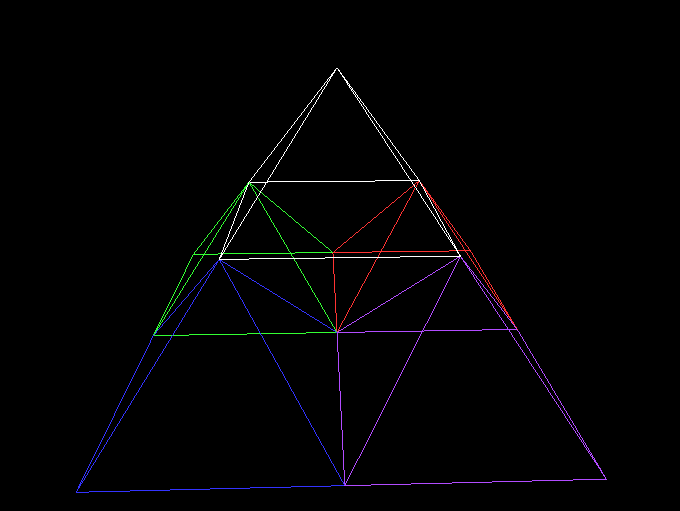

3D L-System Viewer
==================

This is a small OpenGL program that renders uses an L-system and turtle
graphics to draw 3D fractals.



(It looks better in motion!)


Compiling
=========

Building this requires `gcc` to be installed and available on your path, and
for GLFW to be installed.

On Linux
--------

Edit the `Makefile` to replace the `GLFW_DIR` variable with the path where GLFW
is installed on your system. Alternatively, set the `GLFW_DIR` environment
variable. Afterwards run `make` to compile the program.

On Windows
----------

Edit `build_windows.bat` and replace any occurrences of `C:\bin\glfw-3.3.3\`
with the path where GLFW is installed on your system. Afterwards, run
`build_windows.bat` to compile the program.


Running the Program
===================

Run `./l_system_3d` (or `l_system_3d.exe` on Windows). A window should appear
displaying an L-system rendering. This can be controlled using some simple
keypresses:

 - Increase iterations by 1: Press the "up" arrow key.

 - Decrease iterations by 1: Press the "down" arrow key.

 - Reload the config file: Press the "R" key.

 - Quit the program: Close the window, or press the escape key.

Configuring the L-System
========================

The system reads its configuration from the "config.txt" file.  The file
must contain only ASCII characters. It starts with the L-system definition
(replacement rules). Following a line containing the keyword `actions`, the
file switches to defining the drawing actions the "turtle" takes when
encountering each character. (The `actions` line must occur exactly once in the
config.)

If you want a longer example, the default "config.txt" contains instructions
for drawing a multi-colored Sierpinski pyramid. A simpler, single, dragon-curve
example can be obtained by replacing the contents of "config.txt" with the
following lines:
```
init F
F F+G
G F-G

actions
F
move_forward 1.0
G
move_forward 1.0
-
rotate -90.0
+
rotate 90.0
```

Any lines starting with `#` in the config file are ignored. So, in addition to
L-system characters being limited to ASCII, non-printing, whitespace
characters, and the `#` character are not allowed in replacement rules. Note
that the `#` must be the first non-whitespace character in the line.

Replacement Rules
-----------------

The first part of the config defines the replacement rules. This section of
the file ends when the line containing the word `actions` is encountered.
Exactly one line in this part of the file must give the initial contents of the
L-system string:

 - `init <initial text>`

All other non-blank and non-comment lines in this section take the following
format:

 - `<character> <string of replacement characters>`

The character is separated from the string of replacements by one or more tab
or space characters.

Characters with no defined replacement rules are left as-is during L-system
iteration. Any line containing a character with no following replacement text
indicates that the character is to be deleted when encountered (i.e. replaced
with a blank string).

Each character can have at most one replacement rule.

Action Rules
------------

Following the `actions` line, the config switches to defining what each
character means for drawing the graphics. Actions for a character are defined
as follows:

```
<character>
<action 1>
<action 2>
...
<action n>
```

In other words, the character must first appear on a line by itself. The
following lines must contain the arbitrary number of actions to be taken when
the character is processed. The list of actions ends when either the end of the
file is reached or another line containing a single character is reached. (Note
that none of the actions are a single character long, so there is no ambiguity
between lines containing a single character and lines containing an action.)

Each character is allowed at most one associated sequence of actions. Any
character that does not appear in the actions section prompts no drawing
actions when rendering the L-system. (This can also be achieved by including
a character in the actions section, but not specifying any actions after it.)

Available Actions
-----------------

The following list of actions are supported:

 - `move_forward <distance>`: Moves the turtle forward the given distance, and
   draws the line segment along its path. The distance is a floating-point
   number of units. Units are not particularly relevant, because the resulting
   3D rendering will be scaled to fit in the viewport regardless.

 - `rotate <degrees>`: Rotates the turtle to its left by the given
   floating-point number of degrees.

 - `yaw <degrees>`: The same as the `rotate` action.

 - `pitch <degrees>`: Rotates the turtle in the upwards direction by the given
    floating-point number of degrees.

 - `roll <degrees>`: Rotates the turtle by the given number of degrees about
   its forward-facing axis.

 - `move_forward_nodraw <distance>`: Like `move_forward`, but does not draw a
   line segment.

 - `set_color_r <value>`: Sets the turtle's red color channel to the given
   value. The value will be clamped to be between 0.0 and 1.0.

 - `set_color_g <value>`: The same as `set_color_r`, but for the green channel.

 - `set_color_b <value>`: The same as `set_color_r`, but for the blue channel.

 - `set_color_a <value>`: The same as `set_color_r`, but for the alpha channel.

 - `push_position 0.0`: Pushes the turtle's current position onto a stack of
   positions, so that it can be restored later. The "0.0" is ignored, but
   required to simplify internal config-parsing logic.

 - `pop_position 0.0`: Restores the turtle's current position from whichever
   position is on top of the stack. Removes the position on top of the stack.
   It is an error to encounter this instruction if the stack is already empty.
   Once again, the "0.0" argument is ignored, but required in the config.

 - `push_color 0.0`: Analogous to `push_position`, but saves the turtle's
   current color on a stack.

 - `pop_color 0.0`: Analogous to `pop_position`, but restores the last color
   pushed by `push_color`.

Prior to taking any actions, the turtle is initialized at position (0, 0, 0),
facing in the positive-X direction, with its pitch and roll set so that its
"back" is facing upwards; in the positive-Y direction.

